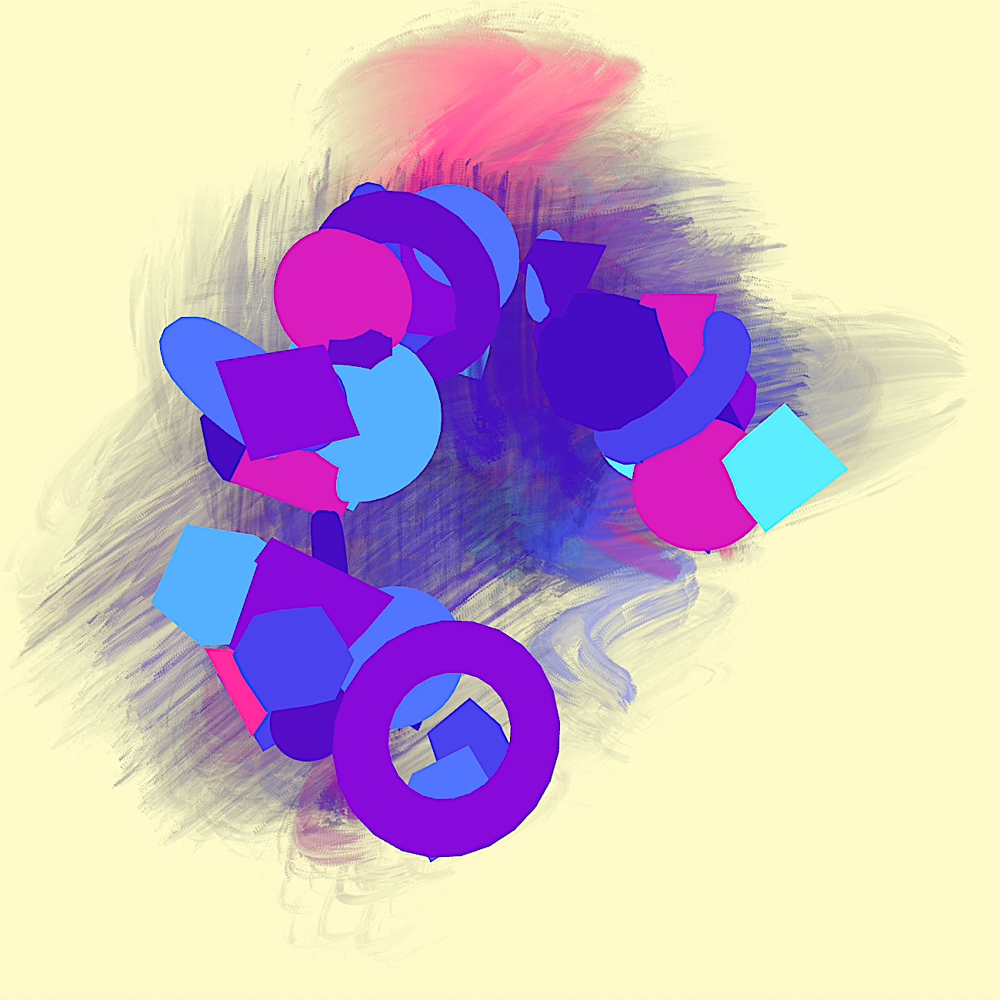

# Three.js Project: Creative Coding Composition

Build a dynamic 3D composition with Three.js! In this tutorial explore creative ways to arrange elements into a cool composition.

Watch the tutorial on [YouTube](https://youtu.be/vXjnbu1f7Cs)

❤️ Support my work: [Patreon](https://www.patreon.com/c/RobotBobby) Thanks! 

#threejs #creativecoding #webgpu #dragcontrols #sprites

## Development
Modify `index.js` to experiment with different Three.js objects, materials, or effects.

## License
This project is licensed under the MIT License. Feel free to modify and distribute.

